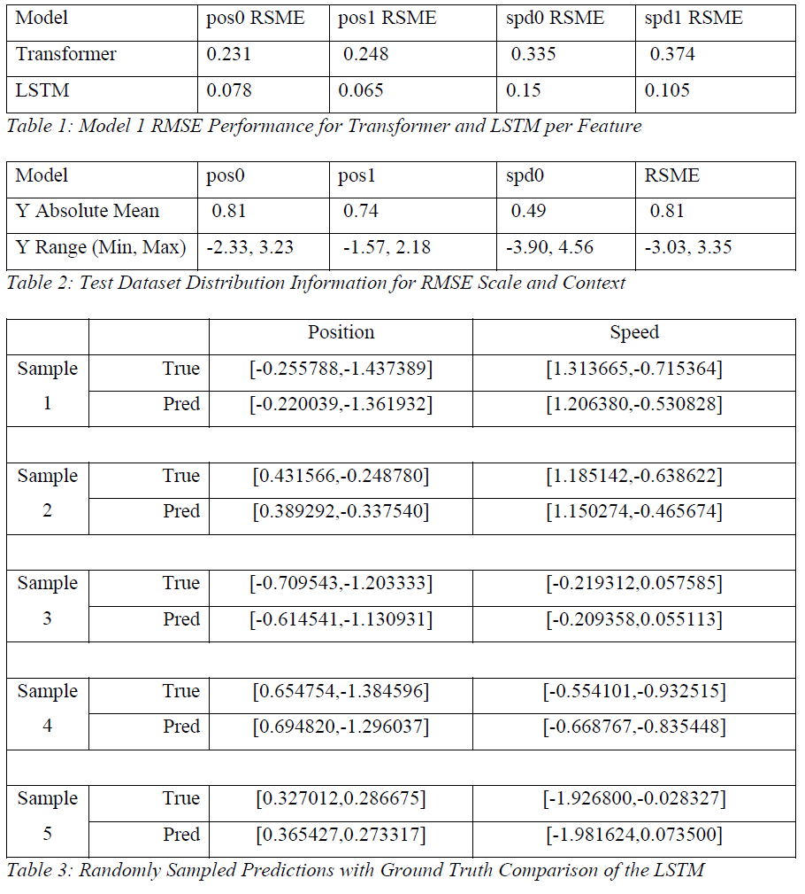
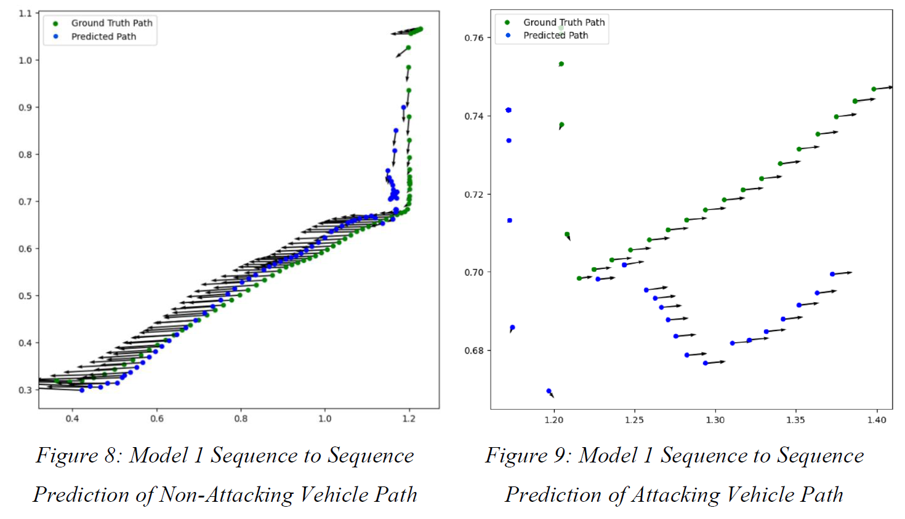

# 5G-BSM-Threat-Detection

Connected and Autonomous Vehicles (CAVs) have the potential to revolutionize transportation and road safety. For CAVs to communicate amongst themselves they use Vehicle-to-Vehicle and Vehicle-to-Infrastructure (V2V and V2I) communication to share information among vehicles and infrastructure, leading to better hazard detection and safer driving. However, the increased connectivity and use of various sensor systems also pose security risks, making it crucial to develop misbehaviour detection (MBD) mechanisms to enhance the security and safety of CAVs. The following report proposes a novel deep-learning approach for MBD in a CAV system running on a 5G network. The proposed approach aims to improve the accuracy and efficiency of misbehaviour detection, addressing the growing security concerns in CAVs. A two-model approach will be outlined which was designed to learn and understand expected the behaviour of real cars, making the system robust to unknown attacks and future threats. The system will also show an ability to understand the context that a car is operating in, to improve MBD accuracy.

## Model 1 Results

## Model 2 Predictions

## Model 2 Results

Dataset Used: https://veremi-dataset.github.io/
